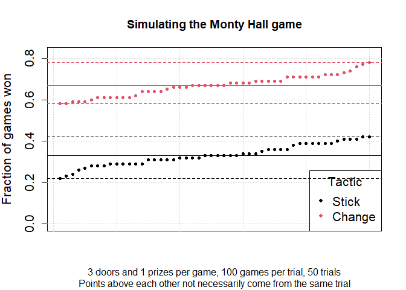

# MontyHall

With `MontyHall` you can simulate the Monty Hall game as an illustration
of simulation studies.

This package is still under development and thus *unstable*.

## Installation

You can install `MontyHall` from
[GitHub](https://github.com/JesseAlderliesten/MontyHall) with:

``` r
if(!requireNamespace("remotes", quietly = TRUE)) {
  install.packages(pkgs = "remotes", quiet = FALSE)
}
remotes::install_github(repo = "JesseAlderliesten/MontyHall", dependencies = TRUE,
                        upgrade = FALSE, force = FALSE, quiet = FALSE,
                        build_vignettes = TRUE, lib = NULL,
                        verbose = getOption("verbose"))
```

For information about installing and configuring R and RStudio, see my
repository
[checkrpkgs](https://github.com/JesseAlderliesten/checkrpkgs).

## Examples

Play a typical game a hundred times, and show the fraction of games won
if the participant sticks to the original choice or changes to another
door:

``` r
library(MontyHall)
set.seed(314)

many_games <- play_MontyHall_repeated(n_doors = 3, n_prizes = 1, n_games = 100)
length(which(many_games$stick)) / length(many_games$stick)
#> [1] 0.33
length(which(many_games$change)) / length(many_games$change)
#> [1] 0.67
```

The results of `play_MontyHall()` are stochastic, i.e., every time you
use it you will get different results (unless you run `set.seed(314)`
that sets the random seed, which I used to make results reproducible).
To show how the stochasticity influences the results, the simulation is
repeated fifty times and the results are summarised:

``` r
library(MontyHall)
set.seed(314)
plot_MontyHall_repeated(n_doors = 3, n_prizes = 1, n_games = 100, n_trials = 50,
                        sort_values = TRUE, show_ranges = TRUE,
                        print_summary = TRUE)
```



    #>        Min. 1st Qu. Median   Mean 3rd Qu. Max.
    #> stick  0.22   0.290   0.33 0.3322   0.375 0.42
    #> change 0.58   0.625   0.67 0.6678   0.710 0.78

The different steps in the game can also be performed individually to
get more details.

``` r
library(MontyHall)
set.seed(314)

play_MontyHall(n_doors = 3L, n_prizes = 1L)
#> $stick
#> [1] FALSE
#> 
#> $change
#> [1] TRUE

# Same as:
set.seed(314)
(setup <- setup_MontyHall(n_doors = 3L, n_prizes = 1L))
#> $status
#> [1] TRUE TRUE TRUE
#> 
#> $prize
#> [1] 2
(chosen_door <- choose_door(status = setup$status))
#> [1] 3
(new_status <- reveal_door(status = setup$status, prize = setup$prize,
                           chosen_door = chosen_door))
#> [1] FALSE  TRUE  TRUE
(outcome(status = new_status, prize = setup$prize,
         chosen_door = chosen_door))
#> $stick
#> [1] FALSE
#> 
#> $change
#> [1] TRUE
```

Play a single game with a ten doors and three prizes.  
NB. Currently only a single door is opened before the contestant gets
the choice to stick to the originally chosen door or change to another
door.

``` r
library(MontyHall)
set.seed(314)

play_MontyHall(n_doors = 10L, n_prizes = 3L)
#> $stick
#> [1] FALSE
#> 
#> $change
#> [1] FALSE

# Same as:
set.seed(314)
(setup <- setup_MontyHall(n_doors = 10L, n_prizes = 3L))
#> $status
#>  [1] TRUE TRUE TRUE TRUE TRUE TRUE TRUE TRUE TRUE TRUE
#> 
#> $prize
#> [1]  3  4 10
(chosen_door <- choose_door(status = setup$status))
#> [1] 7
(new_status <- reveal_door(status = setup$status, prize = setup$prize,
                           chosen_door = chosen_door))
#>  [1]  TRUE FALSE  TRUE  TRUE  TRUE  TRUE  TRUE  TRUE  TRUE  TRUE
(outcome(status = new_status, prize = setup$prize,
         chosen_door = chosen_door))
#> $stick
#> [1] FALSE
#> 
#> $change
#> [1] FALSE
```

# Alternatives

Many packages for Monty Hall simulations exist on
[GitHub](https://github.com/). I have not yet browsed through them.
